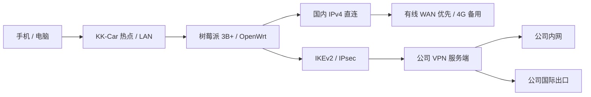

# KK-Car · 车载网络控制台

把闲置的树莓派 3B+ 变成车载路由器：USB 4G 上网、Wi-Fi 热点、回公司 VPN，再用一页中文面板查看和管理整条网络。

本仓库保存 **2026-09-20 的已部署项目源码与维护文档**。这是运行在 OpenWrt / LuCI 上的实际管理面板，使用原有管理员登录；不是演示网页，也不是可以直接刷入 SD 卡的固件。

[使用说明](docs/USAGE.md) · [飞书推送](docs/NOTIFICATIONS.md) · [部署与更新](docs/DEPLOYMENT.md) · [架构与技术说明](docs/ARCHITECTURE.md) · [备份与恢复](docs/BACKUP.md) · [验证与限制](docs/VALIDATION.md)

## 它能做什么

| 功能 | 实际行为 |
| --- | --- |
| 一屏状态面板 | 统一深色布局，电脑优先、兼容手机；流量、CPU、内存、温度、供电、VPN、蜂窝及连接设备同时显示 |
| VPN 管理 | 启动、暂停、重连 IKEv2 / IPsec，设置开机连接；旧 WireGuard 配置在设备上停用保留 |
| 流量与延迟历史 | 下载/上传曲线；VPN Ping 与 LTE RSRP 共享时间轴，支持 1 小时、1 天、30 天 |
| 有线 / 4G 选网 | 网口可切换 LAN 或 DHCP WAN；有线探测稳定后优先，失效后回到 4G |
| 热点设置 | 修改名称、密码，选择 5 GHz 或 2.4 GHz，均为 20 MHz；修改后限时确认，未确认自动恢复 |
| 上网棒状态 | 通过 ADB 只读采集 F30A Pro 的运营商、信号、连接时长及接口流量 |
| 六项网络检查 | 国内出口、VPN 出口、公司服务、国外 DNS，以及 ChatGPT / Gemini 地区信号 |
| 飞书推送 | VPN、开关机、设备接入、出口切换与异常恢复通知；三个地址独立启停，事件开关、可调阈值、重试去重 |
| IPv6 状态 | 检查内核开关、地址与路由；当前部署采用 IPv4，IPv6 已关闭 |

页面只呈现已取得的数据：未知和过期状态不会显示成正常，隧道建立也不等同于网站可用。

## 设备与网络

当前适配环境：**Raspberry Pi 3B+ · OpenWrt 25.12.5 · F30A Pro USB 上网棒 · 爱快 IKEv2 服务端**。



- 管理入口：连接 KK-Car 后访问 `http://192.168.88.1/cgi-bin/luci/admin/kkcar`。
- Wi-Fi 与 LAN：`192.168.88.0/24`；上网棒管理地址：`192.168.0.1`。
- `eth0` 为可切换的有线口，`eth1` 为当前 USB 上网棒，`ikecar` 为 VPN 虚拟接口。
- 国内直连，公司内网与其余公网业务走 VPN；VPN 停止后，国外业务不自动回落到物理 WAN。
- 当前支持 **一个有线 WAN + 一个 USB 4G WAN**。尚未实现多个 USB 上网棒自动选网或带宽叠加。

## 日常使用

1. 连接 KK-Car 热点或 LAN，打开管理地址，用现有 OpenWrt 管理员账号登录。
2. 先看顶部 VPN 状态和供电提醒，再看图表里的实时延迟与丢包。
3. 点击「检查网络」验证实际访问，约 15 秒内显示结果与检查时间。
4. 切换热点或网口后，按页面提示在约 2 分钟内确认保留；没有确认会回退。
5. 点击「最近 1 小时 / 1 天 / 30 天」查看历史，拖动时间滑块读取具体时刻。

完整操作及故障排查见 [使用说明](docs/USAGE.md)。首次迁移到新设备前，请先阅读 [部署前提](docs/DEPLOYMENT.md)：源码仍有特定接口、地址和路由标记约定，不应直接覆盖另一台路由器。

## 数据怎么来的

| 数据 | 采集与保存 |
| --- | --- |
| 页面实时状态 | 每 5 秒读取路由器缓存与计数器 |
| VPN 连通性 | 每 10 秒经 `ikecar` Ping `10.8.8.8`，每轮最多 3 次 |
| 蜂窝信号 | 每约 30 秒通过 ADB 读取一次，排除重复及过期样本 |
| 历史曲线 | 每分钟汇总，约每 5 分钟批量保存，保留 30 天 |
| ChatGPT / Gemini 地区 | 仅点击「检查网络」时请求，无账号、Cookie 或 API 密钥 |

突然断电可能丢失最近约 6 分钟尚未保存的历史。旧时段没有采集的信号保持空白，不补造数据。接口累计流量不是运营商套餐账单。

ChatGPT 读取其域名的 Cloudflare 边缘地区，Gemini 读取页面内部地区字段并标为参考。**非 CN 只代表本次地区信号不为中国大陆，不保证账号、登录或模型功能可用。**

## 仓库结构

```text
README.md                    项目介绍与导航
docs/                        使用、部署、架构、验证和恢复文档
kk-car-ui/
  root/etc/kk-car/            采集、历史、诊断、路由及操作脚本
  root/etc/init.d/            开机服务与恢复服务
  root/etc/hotplug.d/         IPv6 热插拔保护
  root/etc/nftables.d/        国内地址集与防止直出规则
  root/etc/strongswan.d/      无密钥的 strongSwan 行为配置
  root/usr/share/             LuCI 菜单、rpcd 后台与权限
  root/www/                  页面脚本与样式
  install-ethernet.uc         特定拓扑下的有线 WAN 配置迁移
  tests/                     路由器隔离测试与路由测试
PRODUCT.md / DESIGN.md        产品目标与界面约定
```

## 备份范围

公司公网 IP 和实测出口 IP 已替换为文档示例地址；部署前需在本地补齐真实配置，勿提交到仓库。

本仓库是源码与文档备份，**不含管理密码、VPN PSK、SSH 私钥、WireGuard 密钥、实际 UCI 配置、历史数据或整机配置包**。设备上的私密配置备份仍需单独妥善保存；恢复时只下载本仓库不足以重建认证资料。[恢复步骤](docs/BACKUP.md)

已验证的功能、模拟测试与尚未验证的移动场景分开记录，见 [验证与限制](docs/VALIDATION.md)。本版本没有经过长时间行车与跨基站耐久验证。
