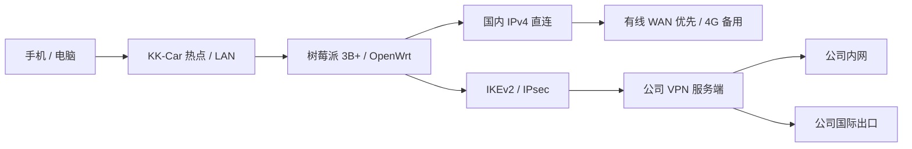

# KK-Car · 车载网络控制台

把闲置的树莓派 3B+ 变成车载路由器：USB 4G 上网、Wi-Fi 热点、回公司 VPN。管理台按使用场景组织为行车总览、连接设置、蜂窝与通信、电源与设备、通知中心；顶部或侧栏可以直接切换。

本仓库保存 **截至 2026-09-25 的项目源码与维护文档**。这是运行在 OpenWrt / LuCI 上的实际管理面板，使用原有管理员登录；不是演示网页，也不是可以直接刷入 SD 卡的固件。

[使用说明](docs/USAGE.md) · [UPS 电源](docs/UPS.md) · [DJI 4G 模块控制](docs/DJI-CONTROL.md) · [开源功能与界面对标](docs/DJI-BENCHMARK.md) · [试验性网页电话](docs/VOICE-CALLS.md) · [DJI 4G / QMI 接入](docs/DJI-QMI.md) · [HDMI 状态屏](docs/HDMI.md) · [电子纸与四键](docs/EPAPER.md) · [飞书推送](docs/NOTIFICATIONS.md) · [部署与更新](docs/DEPLOYMENT.md) · [架构与技术说明](docs/ARCHITECTURE.md) · [备份与恢复](docs/BACKUP.md) · [网络故障与 VPN 备用管理](docs/NETWORK-RECOVERY.md) · [验证与限制](docs/VALIDATION.md)

## 它能做什么

| 功能 | 实际行为 |
| --- | --- |
| 一屏状态面板 | 统一深色布局，电脑优先、兼容手机；下载/上传速度旁同步显示 VPN 延迟与丢包、蜂窝 RSRP/SINR、UPS 电量与输出电压，下方保留系统、出口、VPN、蜂窝和供电详细数据 |
| VPN 备用管理 | 可选开启 VPN 通道内的管理页、SSH 和 Ping；按当前 VPN 地址维护返回路由，仍需原有管理员认证 |
| VPN 管理 | 启动、暂停、重连 IKEv2 / IPsec，设置开机连接；旧 WireGuard 配置在设备上停用保留 |
| 流量与延迟历史 | 单张三层图共用时间轴，速度、VPN 延迟/丢包、LTE RSRP 分别使用独立刻度；支持 5 分钟、1 小时、1 天、30 天 |
| 有线 / 4G 选网 | 网口可切换 LAN 或 DHCP WAN；有线探测稳定后优先，失效后回到 4G |
| 热点设置 | 修改名称、密码，选择 5 GHz 或 2.4 GHz，均为 20 MHz；修改后限时确认，未确认自动恢复 |
| 上网棒状态 | 兼容 F30A ADB 与 DJI 一代 QMI；只读采集运营商、SIM 状态、RSRP/RSRQ/SINR 与接口流量，未知保持留空 |
| DJI 独立控制页 | 左侧导航分开总览、网络详情、短信、电话、流量、定位和设备；总览同时显示实时信号四指标与当前工作小区，网络页提供阈值与更多小区参数；电话页含拨号盘、本机通话记录和联系人；短信自动加载、合并/回复与加密备份；网页电话已有一次短时双向通话实测，长期稳定性待验收 |
| 六项网络检查 | 本机每 10 分钟自动检查国内出口、VPN 出口、公司服务、国外 DNS 和 ChatGPT / Gemini 地区信号，也可手动检查 |
| 飞书推送 | VPN、开关机、设备接入、出口切换与异常恢复通知；DJI 来电/未接提醒与新短信正文可分别启停，三个地址独立控制；事件按场景分组，保存后从设备读回核对 |
| HDMI 本地显示 | 中文高密度只读状态屏，双趋势图、32 项详情、设备和上次检查结果；支持 720p/1080p 布局，真实输出模式需另行配置 |
| 电子纸本地控制台 | Waveshare 2.7 英寸 V2 六页按总览、蜂窝、VPN、短信/流量、UPS 电源、系统分类；首页突出 VPN 延迟、蜂窝信号、未查看短信与关键运行数据；四键负责首页、上下翻页、设置/确认，可运行检查并调整 VPN、Wi-Fi 频段、有线口和 1/3/5/10 分钟刷新周期；高对比度文字、快刷/局刷与灰阶全刷配合，画面按安装方向整体反转 180°，网络设置沿用限时回退 |
| UPS 电源页 | 读取 52Pi EP-0136 的输入、输出、电池、估算电流/功率、RTC 与树莓派供电状态；常用设置与高级维护分区，低电关机默认关闭；展示两路电池电压差与参考来源，明显差异会告警并回退主控；支持按电芯规格设置 2.75V 起的保护值，区分自动与手动模式的电压关系；异常原始采样会重试或报错 |
| IPv6 状态 | 检查内核开关、地址与路由；当前部署采用 IPv4，IPv6 已关闭 |

页面只呈现已取得的数据：未知和过期状态不会显示成正常，隧道建立也不等同于网站可用。

## 设备与网络

当前适配环境：**Raspberry Pi 3B+ · OpenWrt 25.12.5 · DJI 一代 QMI / F30A Pro USB 上网棒 · 爱快 IKEv2 服务端**。



- 管理入口：连接 KK-Car 后访问 `http://192.168.88.1/cgi-bin/luci/admin/kkcar`。
- Wi-Fi 与 LAN：`192.168.88.0/24`；F30A 管理地址跟随实际私有 WAN 网关，DJI 直接通过 QMI 管理。
- `eth0` 为可切换的有线口，USB 上网接口按运行状态发现（CDC 常为 `eth1`，QMI 常为 `wwan0`），`ikecar` 为 VPN 虚拟接口。
- 国内直连，公司内网与其余公网业务走 VPN；VPN 停止后，国外业务不自动回落到物理 WAN。
- 当前支持 **一个有线 WAN + 一个 USB 4G WAN**。尚未实现多个 USB 上网棒自动选网或带宽叠加。

## 日常使用

1. 连接 KK-Car 热点或 LAN，打开管理地址，用现有 OpenWrt 管理员账号登录。
2. 先看顶部 VPN 与供电状态，再看下载/上传速度旁的延迟、丢包、信号和电量；图表用于看变化过程。
3. 网络检查每 10 分钟自动运行，也可点击「检查网络」立即检测，通常约 15 秒内显示结果与检查时间。
4. 切换热点或网口后，按页面提示在约 2 分钟内确认保留；没有确认会回退。
5. 点击「最近 5 分钟 / 1 小时 / 1 天 / 30 天」查看历史，拖动时间滑块读取具体时刻。5 分钟范围仍按分钟汇总，并非秒级曲线。

完整操作及故障排查见 [使用说明](docs/USAGE.md)。首次迁移到新设备前，请先阅读 [部署前提](docs/DEPLOYMENT.md)：源码仍有特定接口、地址和路由标记约定，不应直接覆盖另一台路由器。

## 数据怎么来的

| 数据 | 采集与保存 |
| --- | --- |
| 页面实时状态 | 每 5 秒读取路由器缓存与计数器 |
| VPN 连通性 | 每 10 秒经 `ikecar` Ping `10.8.8.8`，每轮最多 3 次 |
| 蜂窝信号 | 每约 30 秒通过 QMI 或 ADB 只读采集一次，排除重复及过期样本 |
| 历史曲线 | 每分钟汇总，约每 5 分钟批量保存，保留 30 天 |
| ChatGPT / Gemini 地区 | 每 10 分钟自动或手动检查时请求，无账号、Cookie 或 API 密钥 |

突然断电可能丢失最近约 6 分钟尚未保存的历史。旧时段没有采集的信号保持空白，不补造数据。接口累计流量不是运营商套餐账单。

ChatGPT 读取其域名的 Cloudflare 边缘地区，Gemini 读取页面内部地区字段并标为参考。**非 CN 只代表本次地区信号不为中国大陆，不保证账号、登录或模型功能可用。**

## 仓库结构

```text
README.md                    项目介绍与导航
docs/                        使用、部署、架构、验证和恢复文档
kk-car-ui/
  root/etc/kk-car/            采集、历史、诊断、路由及操作脚本
  root/etc/init.d/            开机服务与恢复服务
  root/etc/hotplug.d/         IPv6 热插拔保护
  root/etc/nftables.d/        国内地址集与防止直出规则
  root/etc/strongswan.d/      无密钥的 strongSwan 行为配置
  root/usr/share/             LuCI 菜单、rpcd 后台与权限
  root/www/                  页面脚本与样式
  install-ethernet.uc         特定拓扑下的有线 WAN 配置迁移
  tests/                     路由器隔离测试与路由测试
PRODUCT.md / DESIGN.md        产品目标与界面约定
```

## 备份范围

公司公网 IP 和实测出口 IP 已替换为文档示例地址；部署前需在本地补齐真实配置，勿提交到仓库。

本仓库是源码与文档备份，**不含管理密码、VPN PSK、SSH 私钥、WireGuard 密钥、实际 UCI 配置、历史数据或整机配置包**。设备上的私密配置备份仍需单独妥善保存；恢复时只下载本仓库不足以重建认证资料。[恢复步骤](docs/BACKUP.md)

已验证的功能、模拟测试与尚未验证的移动场景分开记录，见 [验证与限制](docs/VALIDATION.md)。本版本没有经过长时间行车与跨基站耐久验证。

### 持久故障记录

新增设备端每分钟私有故障快照与 UPS 低电即时事件，SD 卡轮转上限约 16 MiB；UPS 页显示记录状态。4G 信号与数据连接独立呈现，QMI 初始化时避免采集查询争用。详见 [故障记录](docs/FAULT-LOG.md)，验证边界见 [验证与限制](docs/VALIDATION.md)。运行日志不上传仓库。
